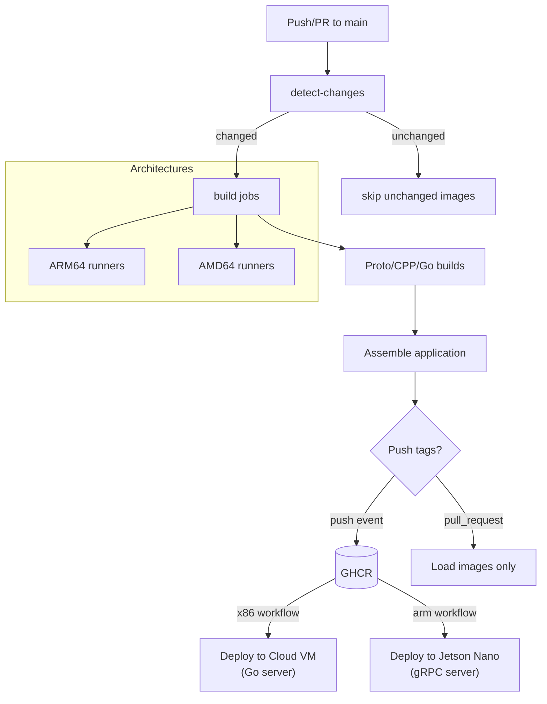

# Continuous Integration Workflows

## Overview
- Three GitHub Actions workflows: `docker-monorepo-build-arm.yml` and `docker-monorepo-build-x86.yml` guard image builds for Jetson-class ARM64 and standard AMD64 targets, and `merge-me.yml` automates label-driven squash merges.
- Both Docker workflows trigger on every push and pull request against `main` (no `paths:` filter on the triggers), with optional manual dispatch; a `detect-changes` job (dorny/paths-filter) filters paths in-run.
- Rebuild decisions come from the path-change flags emitted by `detect-changes`; component versions are only read to compute image tags (no GHCR manifest inspection).
- Jobs execute on self-hosted runners: the ARM64 build jobs require the `self-hosted / Linux / ARM64` labels (build jobs add `dev`), and the x86 jobs run on `self-hosted / Linux / X64` machines.
- **merge-me**: label-driven squash-merge automation — labeling a PR asks the workflow to merge it once checks are green; removing the label disarms it. It is triggered by `pull_request` label events and by either Docker workflow completing (`workflow_run`), so the second CI workflow's completion lands the merge.

## Trigger Matrix
- `push` to `main` (unfiltered); the `detect-changes` job decides in-run whether Dockerfiles, Bazel modules, protocol buffers, accelerator sources, runtime, integration, or workflow definitions changed.
- `pull_request` targeting `main` (unfiltered), enabling preview builds without publishing images.
- `workflow_dispatch` for manual rebuilds (forces a full rebuild), useful after registry cleanup or runner maintenance.

## Job Sequence
| Workflow | Jobs |
| --- | --- |
| x86 (`docker-monorepo-build-x86.yml`) | `detect-changes`, `build_app`, `build_web_frontend`, `push_app`, `push_web_frontend`, `build_yolo_model`, `push_yolo_model`, `deploy_prod` |
| ARM (`docker-monorepo-build-arm.yml`) | `detect-changes`, `arm_pr`, `build_and_push`, `arm_skip_notice`, `deploy_prod` |

- `detect-changes` outputs (x86): `app`, `web_frontend`, `yolo_model`, `app_version_changed`, `web_frontend_version_changed`, `deployable`.
- `detect-changes` outputs (ARM): `cpp_touched`, `build_proto`, `build_bazel_base`, `build_cpp_deps`, `build_cuda_runtime`, `cpp_version_changed`.
- There is no `prepare` job; GHCR login happens inside the build/push jobs via `docker/login-action`.

## Build Decision Logic
- `detect-changes` filters paths in-run (dorny/paths-filter); no GHCR manifest inspection happens anywhere.
- Outputs such as `app` (x86) or `build_cpp_deps` (ARM) gate downstream jobs; jobs skip early when the output is `false`.
- Versioned tags are computed from VERSION files: `app:${golang_version}-${ARCH}`, `cpp-accelerator-${cpp_version}-proto${proto_version}-${ARCH}`, and the deployed frontend ref `web-frontend:fe-${fe_version}-proto${proto_version}-amd64`.

## Flow Diagram

## Runner Infrastructure
- ARM64 workflow requires the Jetson Nano runners provisioned via Terraform and Ansible; see [`../scripts/README.md#deploymentgithub-runner`](../scripts/README.md#deploymentgithub-runner) for provisioning details and maintenance steps.
- AMD64 workflow targets self-hosted Linux runners with Docker Buildx and GPU toolkits aligned with production requirements.

## Related Automation
- Staging deployments `scripts/deployment/staging_local/` consume the published AMD64 images.
- Production deployments on Jetson hardware use the versioned ARM64 `cpp-accelerator` tag produced by the ARM workflow.
- **Cloud VM Deployment**: The x86 workflow (`docker-monorepo-build-x86.yml`) includes an automated `deploy_prod` job that runs after `push_app`, `push_web_frontend`, and `push_yolo_model` on pushes to `main` (or manual dispatch) when a VERSION file changed. This job:
  - Configures SSH authentication using the `CLOUD_VM_SSH_KEY` secret (no Ansible involved)
  - Syncs `infra/services/compose/learning-cuda.yaml`, production config, data files, and mTLS certificates to the VM via inline SSH/rsync
  - Computes versioned image tags in-workflow (`app:${go_version}-amd64` and `web-frontend:fe-${fe_version}-proto${proto_version}-amd64`, not `latest`) and recreates the `cuda-go-server` / `cuda-web-frontend` services with `docker compose`
  - Requires GitHub secrets: `CLOUD_VM_HOST`, `CLOUD_VM_USER`, `CLOUD_VM_SSH_KEY`, `ACCELERATOR_SERVER_CERT`, `ACCELERATOR_SERVER_KEY`, `ACCELERATOR_CA_CERT`
