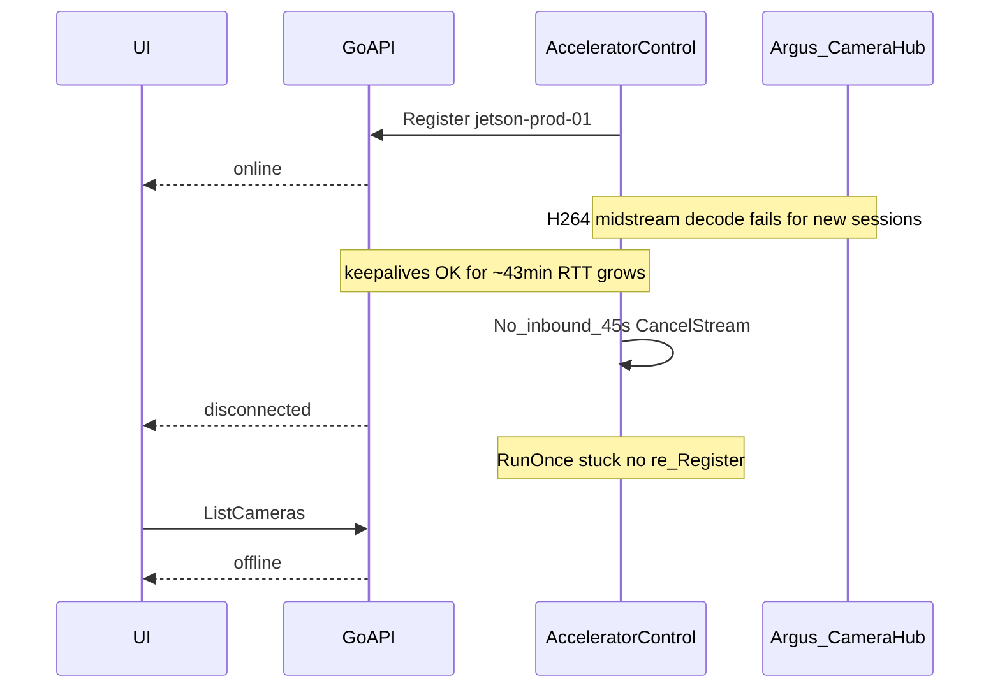

# Registry reconnect hang — accelerator stays unregistered (UI offline)

| Field | Value |
|-------|--------|
| Opened | 2026-07-26 |
| Status | Open — analysis only (no core fix in this doc PR) |
| Go API | `4.6.1` (`cuda-go-server` / `app:4.6.1-amd64`) |
| cpp-accelerator | `4.7.9` (`cpp-accelerator-4.7.9-proto4.7.0-arm64`) |
| proto | `4.7.0` |
| Cloud host | `jrb-vultr1` |
| Jetson host | `jetson-nano-orin` |
| Control device_id | `jetson-prod-01` |

GitHub issue / PR links are filled in under [Revision notes](#revision-notes) after they are created.

---

## Symptoms

- Web UI shows the accelerator as **offline**.
- Go API repeatedly logs `ListCameras: no accelerator session registered`.
- Jetson container `cuda-accelerator-client` remains **Up** (observed “Up 6 weeks”) — this is **not** a docker crash/restart loop.
- Manual restarts of the accelerator (or redeploy) restore registration for a while; the system later falls back into the same unregistered state.
- While still registered, live camera processed video can also fail (see [Related but separate](#related-but-separate-live-h264-decode)).

---

## Complete picture

### Timeline (production, 2026-07-26 UTC)

1. `22:33:23Z` — Go: `ListCameras: no accelerator session registered` (before reconnect).
2. `22:34:04Z` — Go: `accelerator session registered` / `accelerator connected` (`jetson-prod-01`, version `4.7.9`).
3. `22:34:03` Jetson local — Argus camera started (`encode branch 1280x720`); TRT engine loaded.
4. `22:35–23:16` — WebRTC sessions start/stop; keepalives exchanged every ~15s; keepalive RTT grows (~0.1s → ~3s).
5. Concurrently — Jetson floods `Live camera frame processing failed: failed to submit H264 packet to decoder: Invalid data found when processing input` on late-joining sessions (`CameraHub` “already running”).
6. `23:16:52Z` — Go: multiple `WebRTC signaling session closed with error` (`context canceled`).
7. `23:17:08` Jetson — `[AcceleratorControl] No inbound message for 45s — reconnecting`.
8. `23:17:08Z` Go — `accelerator session removed` / `accelerator disconnected`.
9. After that — **no** Jetson logs of `Reconnecting in Ns...`, `Stream failed — reconnecting`, or `Registered, session_id=...`.
10. `23:19Z+` — Go: continuous `ListCameras: no accelerator session registered` (matches UI offline).

### Sequence



### Evidence commands used

```bash
.claude/skills/read-jetson-logs/scripts/fetch-jetson-logs.sh --check
.claude/skills/read-jetson-logs/scripts/fetch-jetson-logs.sh --source both --tail 500 --since 2h \
  --grep 'error|Error|ERROR|FATAL|Argus|WebRTC|CUDA|TRT|AcceleratorControl|reconnect'
.claude/skills/read-cloud-go-logs/scripts/fetch-cloud-go-logs.sh --check
.claude/skills/read-cloud-go-logs/scripts/fetch-cloud-go-logs.sh --tail 500 --since 2h \
  --grep 'accelerator|ListCameras|keepalive|disconnected|connected|warn|error'
```

---

## Hypothesis (primary) — control reconnect hang

### Claim

After the app-level RX watchdog fires, `AcceleratorControlClient::RunOnce` does not return to `Run()`’s reconnect sleep loop. The Go registry correctly drops the device; the Jetson process stays alive but never re-sends `Register`. Restarts clear the hang until the condition recurs.

### Why this matches the logs

- Last control log on Jetson: `No inbound message for 45s — reconnecting` (from `KeepaliveLoop`).
- Expected follow-ups from code are missing:
  - `Stream failed — reconnecting` (end of `RunOnce` when `stream_failed_`)
  - `Stream ended: ...` (`stream->Finish`)
  - `Reconnecting in Ns...` (`Run` loop)
  - `Registered, session_id=...` (successful `RunOnce`)
- Go still received outbound accelerator keepalives until ~`23:17:07Z`, then saw disconnect when the client cancelled the stream — consistent with **outbound Write still working while inbound Read / teardown stalls**.

### Code path

File: [`src/cpp_accelerator/adapters/grpc_control/accelerator_control_client.cpp`](../../src/cpp_accelerator/adapters/grpc_control/accelerator_control_client.cpp)

| Step | Function | Behavior |
|------|----------|----------|
| Watchdog | `IsRxStale` / `KeepaliveLoop` | If no inbound for `keepalive_timeout_s` (45s), log warning, set `stream_failed_`, `CancelStream()`, stop keepalive thread |
| Main loop | `RunOnce` dispatch | Blocked on `stream->Read(&resp)`; should wake on cancel |
| After Read exits | `RunOnce` | Join keepalive + pump, `WritesDone`, `Finish`, `cleanup` / `TeardownLocalSessions` |
| Outer loop | `Run` | On `RunOnce` return false: log `Reconnecting in Ns...`, backoff, retry |

Likely stuck point after cancel (ordered by likelihood from missing logs):

1. `stream->Read` does not return after `TryCancel` (half-open / wedged client stream).
2. `pump_thread.join()` if `CandidatePumpLoop` blocks.
3. `stream->WritesDone()` / `stream->Finish()` hangs.
4. `TeardownLocalSessions` → `CloseSession` blocks (less likely; sessions already tearing down at `23:16:52`).

Go side (correct behavior given client drop):

- [`src/go_api/pkg/infrastructure/processor/control_server.go`](../../src/go_api/pkg/infrastructure/processor/control_server.go) — `accelerator disconnected`
- [`src/go_api/pkg/infrastructure/processor/session.go`](../../src/go_api/pkg/infrastructure/processor/session.go) — keepalive interval 15s / timeout 45s (defaults in config)
- [`src/go_api/pkg/infrastructure/processor/camera_repository.go`](../../src/go_api/pkg/infrastructure/processor/camera_repository.go) — `ListCameras: no accelerator session registered`

### Confidence

**High** that the offline UI is “no registry session after disconnect.”  
**Medium-high** that `RunOnce` is stuck post-cancel (log silence is strong; need a repro with stage logging or gdb to pin the exact blocking call).

---

## Related but separate: live H264 decode

Not the cause of “offline,” but observed in the same window and may increase load before the control hang.

- Argus encode: `x264enc … intra-refresh=true` + `h264parse config-interval=-1` → SPS/PPS once at pipeline start.
- `CameraHub` keeps the camera open with zero subscribers; late WebRTC subscribers get mid-stream P-frames.
- Each session’s `LiveVideoProcessor` opens a fresh FFmpeg H.264 decoder → `avcodec_send_packet` → `AVERROR_INVALIDDATA`.
- `StartCameraStream … 0x0@0fps` is the FE omitting width/height/fps; Argus still defaults to 1280×720.

Documented in-tree: `src/cpp_accelerator/application/bird_watch/README_STILLS.md` (“Recovery from packet loss”).

Track as a separate fix (parameter sets / IDRs / Hub cache of first AU). Do not conflate with registry reconnect.

---

## Proposed fix (follow-up PR — not this branch)

Goal: after RX-stale cancel, always return to `Run()` and successfully `Register` again without requiring a container restart.

### Approach

1. **Stage logging** around cancel → read exit → joins → `WritesDone`/`Finish` → cleanup → reconnect sleep (makes the next hang self-diagnosing).
2. **Hardening teardown** so cancel cannot leave `RunOnce` wedged forever:
   - Ensure `CancelStream` / `TryCancel` is always invoked once and is safe under `write_mutex_`.
   - Bound or detach blocking gRPC teardown (`Finish` / joins) with a timeout; if exceeded, abandon the channel object and continue reconnect.
   - Audit `CandidatePumpLoop` for blocking calls that ignore `connection_stop`.
3. **Tests** — simulate stuck `Read` after cancel (fake stream / injectable transport) and assert the outer `Run` loop continues within a deadline.
4. Optional follow-ups (only if still needed after 1–3): revisit whether RX timer should require application keepalive vs any successful `Read`; avoid coupling video-path CPU storms to control-thread health (error log rate limits).

### Out of scope for the reconnect fix PR

- H264 SPS/PPS mid-join (separate issue).
- Go registry changes (Go already drops correctly).
- Forced Jetson restarts as a “fix.”

---

## VERSION bump, auto PR, and deploy validation (for the fix PR)

When implementing the C++ reconnect fix:

### 1. Version bump

- Edit [`src/cpp_accelerator/VERSION`](../../src/cpp_accelerator/VERSION): e.g. `4.7.9` → `4.7.10`.
- Pre-commit [`scripts/hooks/pre-commit-version-check.sh`](../../scripts/hooks/pre-commit-version-check.sh) requires the VERSION file to change when files under `src/cpp_accelerator/` are staged.
- Do **not** bump Go/FE VERSION unless those trees change.

### 2. Branch + PR (automatic path)

```bash
git checkout -b fix/accelerator-control-reconnect-hang origin/main
# implement fix + bump src/cpp_accelerator/VERSION
git add -A && git commit -m "$(cat <<'EOF'
fix: unblock accelerator control reconnect after rx-stale

EOF
)"
git push -u origin HEAD
gh pr create --title "fix: unblock accelerator control reconnect after rx-stale" --body "$(cat <<'EOF'
## Summary
- Prevent AcceleratorControlClient from hanging after RX-stale cancel so Register retries.
- Bumps cpp-accelerator VERSION for Jetson deploy gate.

## Test plan
- [ ] Unit/integration: cancel during Read still reaches reconnect loop
- [ ] After merge: ARM deploy_prod runs; Jetson image tag includes new VERSION
- [ ] fetch-jetson-logs --check shows new image; Go shows accelerator connected
- [ ] Soak: no permanent ListCameras: no accelerator session registered

Closes #<registry-issue-number>
EOF
)"
```

Merge to `main` triggers CI. See [`.github/workflows/README_arm.md`](../../.github/workflows/README_arm.md).

### 3. Deploy gates

| Component | VERSION file | Deploy when bumped |
|-----------|--------------|--------------------|
| cpp-accelerator → Jetson | `src/cpp_accelerator/VERSION` | ARM `deploy_prod` (`cpp_version_changed`) |
| Go API → cloud VM | `src/go_api/VERSION` | x86 `deploy_prod` |
| Frontend | `src/front-end/VERSION` | x86 `deploy_prod` |

Docs-only PRs (this file) do **not** bump VERSION and do **not** deploy.

### 4. Validate versions are deployed

```bash
# Jetson image / container
.claude/skills/read-jetson-logs/scripts/fetch-jetson-logs.sh --check
# Expect image tag containing new cpp VERSION (e.g. cpp-accelerator-4.7.10-...)

# Control plane registration
.claude/skills/read-cloud-go-logs/scripts/fetch-cloud-go-logs.sh --tail 50 --since 30m \
  --grep 'accelerator connected|accelerator disconnected|ListCameras: no accelerator|Registered'

# Expected healthy signals
# - Go: accelerator connected for jetson-prod-01
# - Jetson: Registered, session_id=...
# - UI: accelerator online; ListCameras returns cameras
# - Soak: keepalives continue; no sticky offline after No inbound message for 45s
```

If Go-side changes are ever required, bump `src/go_api/VERSION` and follow [`.github/workflows/README_x86.md`](../../.github/workflows/README_x86.md); validate with `fetch-cloud-go-logs.sh --check` that the app image tag matches.

---

## Revision notes

### 2026-07-26

- **Actions:** Read-only production triage via `read-jetson-logs` and `read-cloud-go-logs`. No Jetson/cloud mutations. No core code changes.
- **Hypothesis:** RX-stale cancel in `AcceleratorControlClient` leaves `RunOnce` wedged; Go drops registry session; UI offline until process restart. H264 mid-stream decode is a separate concurrent failure.
- **Evidence:** Timeline above; Jetson silence after reconnect warning; Go `accelerator disconnected` then persistent `ListCameras: no accelerator session registered`.
- **Deliverable this date:** This analysis file on branch `docs/registry-reconnect-hang-go4.6.1-cpp4.7.9` (docs PR + GitHub bug).
- **GitHub:** _(fill after create)_ Issue: TBD — PR: TBD
- **Next agent checklist:**
  1. Confirm issue/PR links below are filled.
  2. Implement proposed fix on a `fix/` branch; bump `src/cpp_accelerator/VERSION`.
  3. Add stage logs first if the hang site is still ambiguous.
  4. Open fix PR linking this doc and closing the GitHub bug.
  5. After merge, run deploy validation commands in section above; append a new dated revision note with results.
  6. Optionally open a separate issue for H264 SPS/PPS late-join.

---

## References

- [`src/cpp_accelerator/adapters/grpc_control/accelerator_control_client.cpp`](../../src/cpp_accelerator/adapters/grpc_control/accelerator_control_client.cpp)
- [`src/go_api/pkg/infrastructure/processor/control_server.go`](../../src/go_api/pkg/infrastructure/processor/control_server.go)
- [`src/go_api/pkg/infrastructure/processor/session.go`](../../src/go_api/pkg/infrastructure/processor/session.go)
- [`.github/workflows/README_arm.md`](../../.github/workflows/README_arm.md)
- [`.github/workflows/README_x86.md`](../../.github/workflows/README_x86.md)
- [`docs/ci-workflows.md`](../ci-workflows.md)
