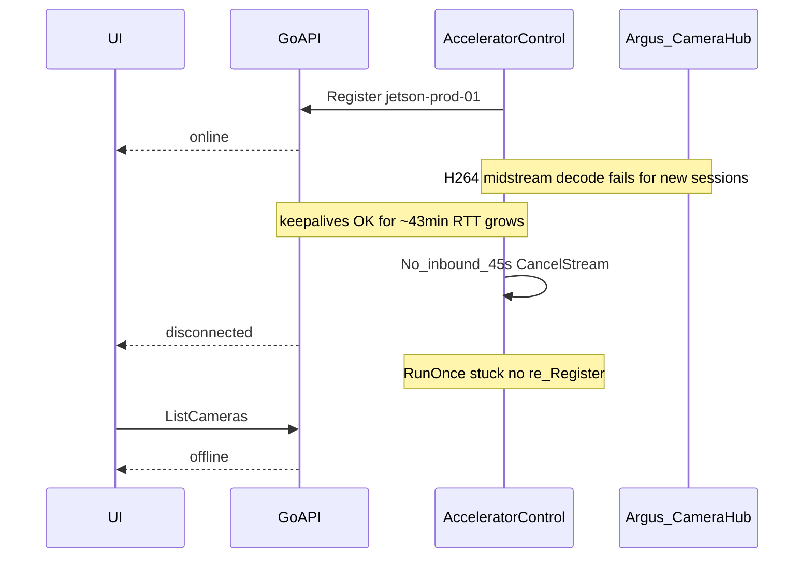

# Registry reconnect hang — accelerator stays unregistered (UI offline)

| Field | Value |
|-------|--------|
| Opened | 2026-07-26 |
| Status | Deployed (cpp `4.7.10` / Go `4.6.2`); reconnect path confirmed in production on 2026-07-27 (see [Revision notes](#revision-notes)) |
| Go API | observed `4.6.1` → fix bumps to `4.6.2` |
| cpp-accelerator | observed `4.7.9` (`cpp-accelerator-4.7.9-proto4.7.0-arm64`) → fix bumps to `4.7.10` |
| proto | `4.7.0` (unchanged) |
| Cloud host | `jrb-vultr1` |
| Jetson host | `jetson-nano-orin` |
| Control device_id | `jetson-prod-01` |

- GitHub issue: https://github.com/josnelihurt-code/learning-cuda/issues/745
- Docs PR: https://github.com/josnelihurt-code/learning-cuda/pull/744
- Fix PR: https://github.com/josnelihurt-code/learning-cuda/pull/746

---

## Symptoms

- Web UI shows the accelerator as **offline**.
- Go API repeatedly logs `ListCameras: no accelerator session registered`.
- Jetson container `cuda-accelerator-client` remains **Up** (observed “Up 6 weeks”) — this is **not** a docker crash/restart loop.
- Manual restarts of the accelerator (or redeploy) restore registration for a while; the system later falls back into the same unregistered state.
- While still registered, live camera processed video can also fail (see [Related but separate](#related-but-separate-live-h264-decode)).

---

## Complete picture

### Timeline (production, 2026-07-26 UTC)

1. `22:33:23Z` — Go: `ListCameras: no accelerator session registered` (before reconnect).
2. `22:34:04Z` — Go: `accelerator session registered` / `accelerator connected` (`jetson-prod-01`, version `4.7.9`).
3. `22:34:03` Jetson local — Argus camera started (`encode branch 1280x720`); TRT engine loaded.
4. `22:35–23:16` — WebRTC sessions start/stop; keepalives exchanged every ~15s; keepalive RTT grows (~0.1s → ~3s).
5. Concurrently — Jetson floods `Live camera frame processing failed: failed to submit H264 packet to decoder: Invalid data found when processing input` on late-joining sessions (`CameraHub` “already running”).
6. `23:16:52Z` — Go: multiple `WebRTC signaling session closed with error` (`context canceled`).
7. `23:17:08` Jetson — `[AcceleratorControl] No inbound message for 45s — reconnecting`.
8. `23:17:08Z` Go — `accelerator session removed` / `accelerator disconnected`.
9. After that — **no** Jetson logs of `Reconnecting in Ns...`, `Stream failed — reconnecting`, or `Registered, session_id=...`.
10. `23:19Z+` — Go: continuous `ListCameras: no accelerator session registered` (matches UI offline).

### Sequence



### Evidence commands used

```bash
.claude/skills/read-jetson-logs/scripts/fetch-jetson-logs.sh --check
.claude/skills/read-jetson-logs/scripts/fetch-jetson-logs.sh --source both --tail 500 --since 2h \
  --grep 'error|Error|ERROR|FATAL|Argus|WebRTC|CUDA|TRT|AcceleratorControl|reconnect'
.claude/skills/read-cloud-go-logs/scripts/fetch-cloud-go-logs.sh --check
.claude/skills/read-cloud-go-logs/scripts/fetch-cloud-go-logs.sh --tail 500 --since 2h \
  --grep 'accelerator|ListCameras|keepalive|disconnected|connected|warn|error'
```

---

## Hypothesis (primary) — control reconnect hang

### Claim

After the app-level RX watchdog fires, `AcceleratorControlClient::RunOnce` does not return to `Run()`’s reconnect sleep loop. The Go registry correctly drops the device; the Jetson process stays alive but never re-sends `Register`. Restarts clear the hang until the condition recurs.

### Why this matches the logs

- Last control log on Jetson: `No inbound message for 45s — reconnecting` (from `KeepaliveLoop`).
- Expected follow-ups from code are missing:
  - `Stream failed — reconnecting` (end of `RunOnce` when `stream_failed_`)
  - `Stream ended: ...` (`stream->Finish`)
  - `Reconnecting in Ns...` (`Run` loop)
  - `Registered, session_id=...` (successful `RunOnce`)
- Go still received outbound accelerator keepalives until ~`23:17:07Z`, then saw disconnect one second later.

### Code path

File: [`src/cpp_accelerator/adapters/grpc_control/accelerator_control_client.cpp`](../../src/cpp_accelerator/adapters/grpc_control/accelerator_control_client.cpp)

| Step | Function | Behavior |
|------|----------|----------|
| Watchdog | `IsRxStale` / `KeepaliveLoop` | If no inbound for `keepalive_timeout_s` (45s), log warning, set `stream_failed_`, `CancelStream()`, stop keepalive thread |
| Main loop | `RunOnce` dispatch | Blocked on `stream->Read(&resp)`; should wake on cancel |
| After Read exits | `RunOnce` | Join keepalive + pump, `WritesDone`, `Finish`, `cleanup` / `TeardownLocalSessions` |
| Outer loop | `Run` | On `RunOnce` return false: log `Reconnecting in Ns...`, backoff, retry |

### Narrowing the stuck point

The `Stream failed — reconnecting` warn sits at the top of the teardown block, *before* the joins, `WritesDone`, `Finish` and `TeardownLocalSessions`. Its absence means execution never reached that line, which **excludes** every candidate that runs after it. Only two statements live between the watchdog's warning and that warn:

1. **`CancelStream()` deadlocking on `write_mutex_`.** `Send()` held `write_mutex_` across the blocking `stream_->Write()`, and `CancelStream()` took that *same* mutex before calling `TryCancel()` — the escape hatch was gated on the lock the wedged writer holds. A stalled write therefore froze the watchdog thread between its log line and any further output, left `Read` blocked forever, and also hung `Stop()` (so SIGTERM would not recover either). `TryCancel()` is itself thread-safe; the mutex bought nothing.
2. **`stream->Read` not returning after `TryCancel`** (half-open / wedged client stream).

Evidence discriminates between them for *this* incident: Go saw the disconnect at `23:17:08Z`, one second after the last keepalive — far too fast for Go's own 45s stale watchdog, so a real RST reached the server, so `TryCancel()` did execute. That points at **(2)** on 07-26. **(1)** is nonetheless a provable deadlock in the code that will eventually fire, and is fixed here.

### Competing hypothesis — the logging pipeline, not the control loop

The whole primary argument rests on *“no logs ⇒ code is stuck.”* That inference is unsafe with the logger as it was:

- `core/logger.cpp` builds a fully synchronous logger with `flush_on(level)` — every record blocks on a file write **and** the docker stdout pipe.
- The file sink was a `basic_file_sink` on `/tmp/cppaccelerator.log` with **no rotation**.
- `webrtc_manager.cpp` logged one `spdlog::error` **per failed frame** — 30fps × sessions, for ~40 minutes.

If `/tmp` filled or the docker json-file consumer stalled, every thread that logs blocks or drops, and the silence says nothing about `RunOnce`. Under this reading the H264 flood is *causal*, not incidental.

**Discriminator (cheap, do this before trusting the primary hypothesis):** were there **any** Jetson logs after `23:17:08` from *any* subsystem (Argus, WebRTC, ffmpeg), or did all output stop at once? Simultaneous silence across subsystems indicts the logger; control-only silence indicts `RunOnce`. Also collect `df -h` and `ls -l /tmp/cppaccelerator.log*` on the device.

### Contributing cause — the disconnect was probably self-inflicted

`Dispatch()` ran inline on the read thread, and `HandleSignalingMessage` calls `WebRTCManager::CreateSession` / `CloseSession` synchronously — these take seconds. `IsRxStale()` is pure wall-clock, so a slow handler makes the watchdog declare a healthy stream dead. Worse, the read loop re-checked `IsRxStale()` on the message it had *just successfully read*, before touching the RX timer — so one long dispatch guaranteed a teardown on the very next read. The WebRTC session churn at `23:16:52` immediately preceding the `23:17:08` timeout fits this exactly, as does the keepalive RTT growth (0.1s → 3s).

### Go side — correct in this incident, two latent races

Go behaved correctly on 07-26 (it logged no second `accelerator session registered`), but the registry had two bugs that produce *precisely* this symptom class:

- `Registry.Remove(deviceID)` was keyed by device_id only and runs from the old stream's `defer`. A fast reconnect can have the new session registered first, after which the old defer deletes the **new** entry — the Jetson believes it is registered and keeps sending keepalives while the API reports `no accelerator session registered` forever.
- `Registry.Add` rejected on `len(sessions) > 0` rather than on a *different* device_id, so a reconnect racing the old teardown got `AlreadyExists` and backed off for no reason.

Both are fixed here. The earlier claim that “Go registry changes are out of scope” was too strong.

Reference files:

- [`src/go_api/pkg/infrastructure/processor/control_server.go`](../../src/go_api/pkg/infrastructure/processor/control_server.go) — `accelerator disconnected`
- [`src/go_api/pkg/infrastructure/processor/session.go`](../../src/go_api/pkg/infrastructure/processor/session.go) — keepalive interval 15s / timeout 45s (defaults in config)
- [`src/go_api/pkg/infrastructure/processor/registry.go`](../../src/go_api/pkg/infrastructure/processor/registry.go) — `Add` / `Remove`
- [`src/go_api/pkg/infrastructure/processor/camera_repository.go`](../../src/go_api/pkg/infrastructure/processor/camera_repository.go) — `ListCameras: no accelerator session registered`

### Confidence

**High** that the offline UI is “no registry session after disconnect.”
**High** that the `CancelStream`/`write_mutex_` deadlock is a real defect (read from the code, not inferred from logs) — but **not** confirmed as the trigger on 07-26.
**Medium** that `RunOnce` was wedged in `Read` on 07-26; the log-silence evidence is only as good as the logging pipeline, which was itself suspect. The stage logs added by this fix make the next occurrence self-diagnosing either way.

---

## Candidate contributing cause: live H264 decode

Not itself the cause of “offline,” but it is the source of the error flood that feeds the logging-pipeline hypothesis above, and it loads the device in the window before the control hang.

- Argus encode: `x264enc … intra-refresh=true` + `h264parse config-interval=-1` → SPS/PPS once at pipeline start.
- `CameraHub` keeps the camera open with zero subscribers; late WebRTC subscribers get mid-stream P-frames.
- Each session’s `LiveVideoProcessor` opens a fresh FFmpeg H.264 decoder → `avcodec_send_packet` → `AVERROR_INVALIDDATA`.
- `StartCameraStream … 0x0@0fps` is the FE omitting width/height/fps; Argus still defaults to 1280×720.

Documented in-tree: `src/cpp_accelerator/application/bird_watch/README_STILLS.md` (“Recovery from packet loss”).

The root H264 fix (parameter sets / IDRs / Hub cache of first AU) is still a separate change and is **not** implemented here. What is implemented here is the log rate-limit that stops the flood from taking the logging pipeline down with it.

---

## Implemented fix

Goal: after RX-stale cancel, always return to `Run()` and successfully `Register` again without requiring a container restart — and, if that ever fails anyway, fail loudly instead of silently.

### C++ — `adapters/grpc_control/accelerator_control_client.{h,cpp}`

| Change | Why |
|--------|-----|
| Split `ctx_` out from under `write_mutex_` into a dedicated `ctx_mutex_`, never held across a blocking call | Removes the `CancelStream` ↔ blocked `Write` deadlock; `TryCancel()` can now always run, which also un-hangs `Stop()` and `cleanup()` |
| `cleanup()` calls `CancelStream()` first, then tears down sessions, then clears the pointers | Guarantees a wedged writer is released before anything takes `write_mutex_` again |
| Read loop touches the RX timer before **and** after `Dispatch()`, and the mid-loop `IsRxStale()` check is gone | A successful `Read` proves liveness; a slow inline handler no longer tears down a healthy stream |
| `Teardown stage: …` info logs after read-loop exit, each join, `WritesDone`, `Finish`, and `cleanup` | The next hang names its own blocking call |
| `ArmTeardownWatchdog()` — armed on the first cancel of a connection; if the connection generation has not advanced after `max(30, 2 × keepalive_timeout_s)`, log `critical`, flush, `std::abort()` | Last-resort escape for a wedged `Read`. A cancelled-but-wedged stream is already unregistered and unreachable; a supervised restart is recoverable, silent limbo is not. Disable with `ACCELERATOR_DISABLE_TEARDOWN_WATCHDOG=1` |

### C++ — logging

| Change | Why |
|--------|-----|
| `core/logger.cpp`: `basic_file_sink` → `rotating_file_sink` (64 MB × 3) | `/tmp/cppaccelerator.log` could grow without bound and fill the device, stalling every logging thread |
| `adapters/webrtc/webrtc_manager.cpp`: live-processing failures log the first 3, then every 300th, with a running count; counter resets on success (`SessionState::live_failure_count`) | Kills the per-frame error flood at 30fps that fed the logging-pipeline hypothesis |

### Go — `pkg/infrastructure/processor/registry.go`

| Change | Why |
|--------|-----|
| `Remove(deviceID string, s *AcceleratorSession)` — only deletes if the registered session *is* `s` | A slow teardown of an old stream can no longer delete the entry a newer stream just created |
| `Add` rejects only a *different* device_id; a re-register from the same device evicts (and cancels) its own stale session | A reconnect that beats the old stream's teardown is no longer rejected with `AlreadyExists` |
| `control_server.go` updated for the new `Remove` signature | Compile |
| New `registry_test.go`: add/remove, second-device rejection, same-device eviction, stale-teardown-does-not-drop-newer | Covers both races |

### Not implemented here

- H264 SPS/PPS mid-join (separate issue — the decode failure itself still happens).
- Moving `Dispatch()` handlers off the read thread (the RX-timer fix removes the harmful consequence; the inline blocking remains).
- Detach-and-abandon of a wedged gRPC channel — the abort watchdog covers the same failure with far less machinery.
- Forced Jetson restarts as a “fix.”

### Verification run locally

```
bazel build //src/cpp_accelerator/adapters/grpc_control/... //src/cpp_accelerator/core/... //src/cpp_accelerator/adapters/webrtc/...   # OK
bazel test  //src/cpp_accelerator/core:logger_test //src/cpp_accelerator/adapters/webrtc/...                                          # 2/2 pass
go test -race ./src/go_api/pkg/infrastructure/processor/...                                                                           # pass
```

No C++ test covers the reconnect path — there is no injectable transport for `AcceleratorControlClient`. That gap is listed in [Remaining steps](#remaining-steps).

---

## Remaining steps

The fix is committed on PR [#746](https://github.com/josnelihurt-code/learning-cuda/pull/746) (`fix/accelerator-control-reconnect-hang`); CI passed on 2026-07-26. Remaining items still open:

1. **Triage the competing hypothesis first** (read-only, no deploy needed):
   ```bash
   .claude/skills/read-jetson-logs/scripts/fetch-jetson-logs.sh --source both --since 24h \
     --grep 'Argus|WebRTC|ffmpeg|AcceleratorControl'
   ```
   Confirm whether Jetson output stopped across *all* subsystems at `23:17:08` or only for the control client, and check `df -h` / `ls -l /tmp/cppaccelerator.log*` on the device. Record the answer in a revision note — it decides whether the primary hypothesis or the logging hypothesis was right.
2. ✅ **Commit** on a `fix/` branch off `main` (`fix/accelerator-control-reconnect-hang`) — VERSION files bumped to cpp `4.7.10` / Go `4.6.2`; pre-commit version check passed. Done (commit `b9d274d`).
3. **Add a C++ regression test** for the reconnect path: extract the stream behind an injectable interface, simulate a `Read` that never returns after cancel, and assert `Run()` reaches its reconnect sleep within a deadline. Without this the abort watchdog is the only thing standing between us and a repeat.
4. ✅ **Open the PR** — [#746](https://github.com/josnelihurt-code/learning-cuda/pull/746) (`Closes #745`); CI green on 2026-07-26 (ARM PR build 2m17s, app image build 1m48s, web-frontend + yolo-model-gen pass). Awaiting review/merge.
5. ✅ **After merge, validate the deploy** — Jetson image `cpp-accelerator-4.7.10-proto4.7.0-arm64`; Cloud Go image `app:4.6.2-amd64` (`go_version: 4.6.2`). Both live on 2026-07-27.
6. **Soak** for at least one full session cycle and grep the Jetson for the new markers:
   ```
   Cancelling control stream
   Teardown stage: read loop exited → keepalive thread joined → pump thread joined → WritesDone returned → Finish returned → cleanup complete
   Reconnecting in Ns... → Registered, session_id=...
   ```
   If instead you see `Control stream did not tear down …s after cancel — aborting`, the wedge is real and the preceding stage log names the blocking call — attach it to #745.
7. **Open a separate issue** for the H264 SPS/PPS late-join root cause.

---

## VERSION bump, auto PR, and deploy validation (for the fix PR)

### 1. Version bump — already applied

- [`src/cpp_accelerator/VERSION`](../../src/cpp_accelerator/VERSION): `4.7.9` → `4.7.10`.
- [`src/go_api/VERSION`](../../src/go_api/VERSION): `4.6.1` → `4.6.2` — required because this fix also changes the Go registry.
- Pre-commit [`scripts/hooks/pre-commit-version-check.sh`](../../scripts/hooks/pre-commit-version-check.sh) requires each VERSION file to change when files under its tree are staged.
- Frontend VERSION is untouched.

### 2. Branch + PR (automatic path)

```bash
git checkout -b fix/accelerator-control-reconnect-hang origin/main
# implement fix + bump src/cpp_accelerator/VERSION
git add -A && git commit -m "$(cat <<'EOF'
fix: unblock accelerator control reconnect after rx-stale

EOF
)"
git push -u origin HEAD
gh pr create --title "fix: unblock accelerator control reconnect after rx-stale" --body "$(cat <<'EOF'
## Summary
- Prevent AcceleratorControlClient from hanging after RX-stale cancel so Register retries.
- Bumps cpp-accelerator VERSION for Jetson deploy gate.

## Test plan
- [ ] Unit/integration: cancel during Read still reaches reconnect loop
- [ ] After merge: ARM deploy_prod runs; Jetson image tag includes new VERSION
- [ ] fetch-jetson-logs --check shows new image; Go shows accelerator connected
- [ ] Soak: no permanent ListCameras: no accelerator session registered

Closes #<registry-issue-number>
EOF
)"
```

Merge to `main` triggers CI. See [`.github/workflows/README_arm.md`](../../.github/workflows/README_arm.md).

### 3. Deploy gates

| Component | VERSION file | Deploy when bumped |
|-----------|--------------|--------------------|
| cpp-accelerator → Jetson | `src/cpp_accelerator/VERSION` | ARM `deploy_prod` (`cpp_version_changed`) |
| Go API → cloud VM | `src/go_api/VERSION` | x86 `deploy_prod` |
| Frontend | `src/front-end/VERSION` | x86 `deploy_prod` |

Docs-only PRs (this file) do **not** bump VERSION and do **not** deploy.

### 4. Validate versions are deployed

```bash
# Jetson image / container
.claude/skills/read-jetson-logs/scripts/fetch-jetson-logs.sh --check
# Expect image tag containing new cpp VERSION (e.g. cpp-accelerator-4.7.10-...)

# Control plane registration
.claude/skills/read-cloud-go-logs/scripts/fetch-cloud-go-logs.sh --tail 50 --since 30m \
  --grep 'accelerator connected|accelerator disconnected|ListCameras: no accelerator|Registered'

# Expected healthy signals
# - Go: accelerator connected for jetson-prod-01
# - Jetson: Registered, session_id=...
# - UI: accelerator online; ListCameras returns cameras
# - Soak: keepalives continue; no sticky offline after No inbound message for 45s
```

If Go-side changes are ever required, bump `src/go_api/VERSION` and follow [`.github/workflows/README_x86.md`](../../.github/workflows/README_x86.md); validate with `fetch-cloud-go-logs.sh --check` that the app image tag matches.

---

## Revision notes

### 2026-07-26

- **Actions:** Read-only production triage via `read-jetson-logs` and `read-cloud-go-logs`. No Jetson/cloud mutations. No core code changes.
- **Hypothesis:** RX-stale cancel in `AcceleratorControlClient` leaves `RunOnce` wedged; Go drops registry session; UI offline until process restart. H264 mid-stream decode is a separate concurrent failure.
- **Evidence:** Timeline above; Jetson silence after reconnect warning; Go `accelerator disconnected` then persistent `ListCameras: no accelerator session registered`.
- **Deliverable this date:** This analysis file on branch `docs/registry-reconnect-hang-go4.6.1-cpp4.7.9` (docs PR + GitHub bug).
- **GitHub:** Issue [#745](https://github.com/josnelihurt-code/learning-cuda/issues/745) — Docs PR [#744](https://github.com/josnelihurt-code/learning-cuda/pull/744)

### 2026-07-26 (later) — code review of the hypothesis + fix implemented

- **Actions:** Reviewed the hypothesis against `accelerator_control_client.{h,cpp}`, `control_server.go`, `session.go`, `registry.go`, `core/logger.cpp`, `otel_log_sink.cpp` and `webrtc_manager.cpp`. Implemented the fix locally. **Nothing committed or deployed.**
- **Corrections to the original analysis:**
  - The stuck-point candidates `pump_thread.join()`, `WritesDone`/`Finish` and `TeardownLocalSessions` all run *after* the missing `Stream failed — reconnecting` warn and are therefore excluded by the doc's own evidence — removed from the list.
  - A `CancelStream` ↔ blocked `Write` deadlock on `write_mutex_` was missing entirely from the analysis; it is a provable code defect (and also hung `Stop()`), now fixed.
  - Go's `23:17:08Z` disconnect one second after the last keepalive proves `TryCancel()` did execute on 07-26, which points at a wedged `Read` rather than the mutex deadlock *for this incident*.
  - Added the logging pipeline as a competing hypothesis: the logger was synchronous, flush-per-record, writing to an unrotated `/tmp` file, while WebRTC logged one error per failed frame. Log silence may not mean the control loop was stuck. The OTLP sink is a bounded, dropping batch processor and is **not** a blocking suspect.
  - Reclassified the H264 flood from “related but separate” to “candidate contributing cause.”
  - Two latent Go registry races documented and fixed; the original “Go registry changes out of scope” was too strong.
- **VERSION:** cpp `4.7.9` → `4.7.10`; Go `4.6.1` → `4.6.2`.
- **Next:** see [Remaining steps](#remaining-steps) — step 1 (log-continuity triage) should happen before trusting the primary hypothesis.

### 2026-07-26 (PR + CI) — fix committed, PR opened, CI green

- **Actions:** Committed the fix on `fix/accelerator-control-reconnect-hang` (off `origin/main`, commit `b9d274d`) — code-only, doc edits kept on this docs branch. Opened fix PR [#746](https://github.com/josnelihurt-code/learning-cuda/pull/746) (`Closes #745`). Pre-commit version check passed.
- **CI:** All checks green on 2026-07-26 — ARM PR build 2m17s, Build app image (PRs only) 1m48s, web-frontend + yolo-model-gen pass, Detect changed paths pass. Deploy/push jobs correctly skipped (run only on merge to `main`).
- **Status:** PR #746 awaiting review/merge; deploy + soak validation still pending (remaining steps 1, 3, 5, 6, 7).

### 2026-07-27 — deployed; reconnect path confirmed in production

- **Deploy:** PR #746 merged to `main`. ARM run `30233285264`: cpp-accelerator built/pushed + **Deploy production (Jetson Nano) succeeded**. x86 run `30233285452`: app image build initially failed on a transient Docker Hub `502 Bad Gateway` pulling `golang:1.24-alpine` (not a code issue); re-ran the failed job, build + **Deploy production to Cloud VM succeeded**.
- **Versions live:** Jetson `cpp-accelerator-4.7.10-proto4.7.0-arm64`; Cloud `app:4.6.2-amd64` (`go_version: 4.6.2`).
- **Reconnect confirmed (the decisive test):** the Cloud VM restart forced the Jetson's control stream to drop at `03:00:28Z`. The Jetson ran the full fixed teardown sequence and re-registered without a container restart:
  ```
  03:00:28  Teardown stage: read loop exited → keepalive joined → pump joined
            → WritesDone → Finish → cleanup complete
  03:00:28  Reconnecting in 1s...              ← previously the hang point (line was absent)
  03:00:40  Failed to send Register (server still booting) — transient, did not hang
  03:00:40  Reconnecting in 2s...              ← backoff + retry
  03:00:42  Registered, session_id=39351a00-…
  ```
  Every new stage log fired; the reconnect loop was reached; a transient failure was absorbed by backoff; the device re-registered. Go confirmed `accelerator connected` v4.7.10 and keepalives every 15s; no `ListCameras: no accelerator session registered` recurred.
- **Caveat:** this exercised the *server-side disconnect* path through the fixed teardown/reconnect code, not the original *app-level RX watchdog* trigger (`No inbound message for 45s`). Soak continues to catch that specific path if it occurs naturally (remaining step 6).

---

## References

- [`src/cpp_accelerator/adapters/grpc_control/accelerator_control_client.cpp`](../../src/cpp_accelerator/adapters/grpc_control/accelerator_control_client.cpp)
- [`src/go_api/pkg/infrastructure/processor/control_server.go`](../../src/go_api/pkg/infrastructure/processor/control_server.go)
- [`src/go_api/pkg/infrastructure/processor/session.go`](../../src/go_api/pkg/infrastructure/processor/session.go)
- [`.github/workflows/README_arm.md`](../../.github/workflows/README_arm.md)
- [`.github/workflows/README_x86.md`](../../.github/workflows/README_x86.md)
- [`docs/ci-workflows.md`](../ci-workflows.md)
