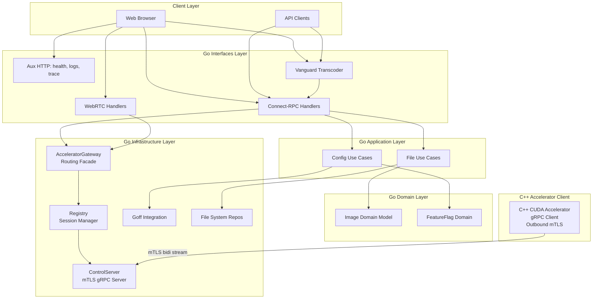
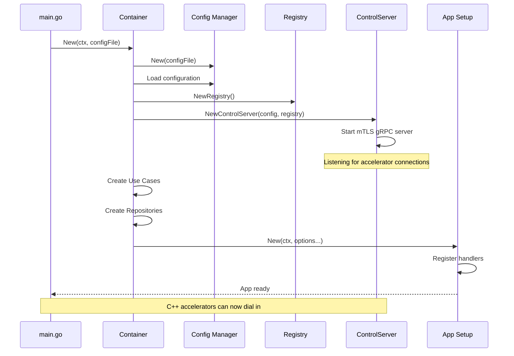
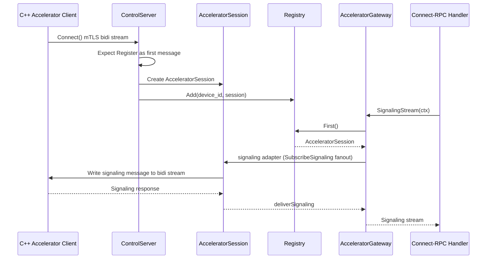
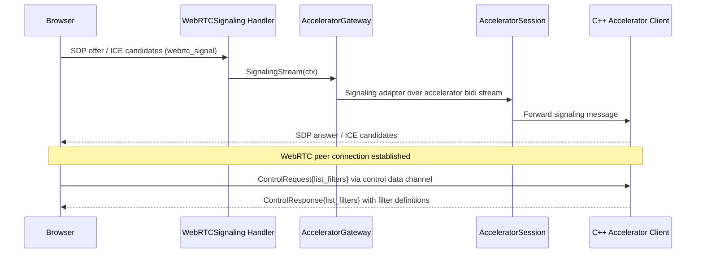
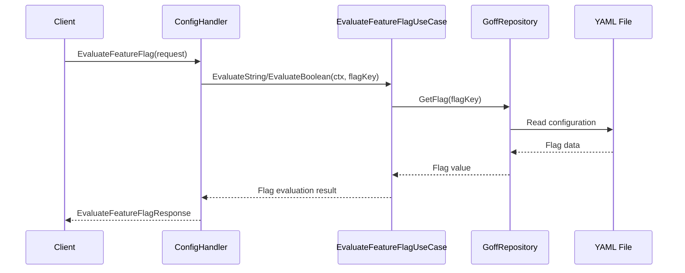
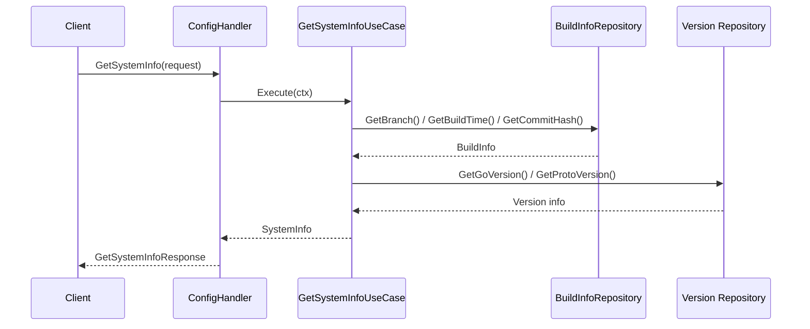
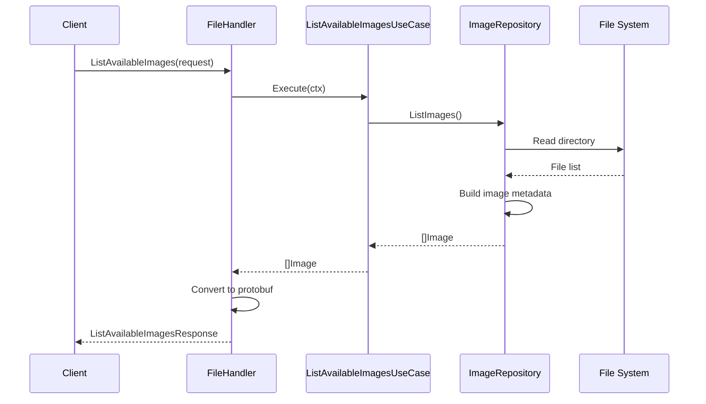
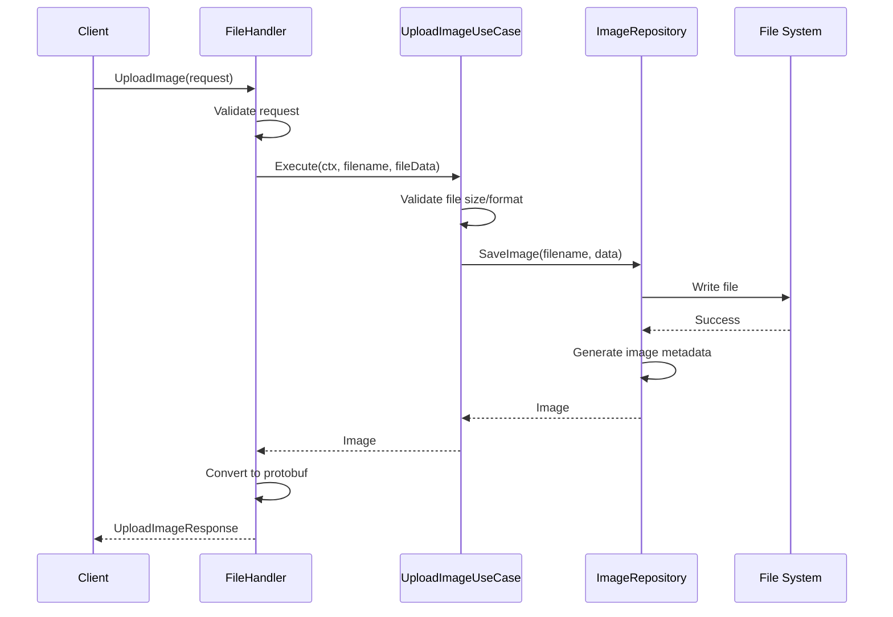
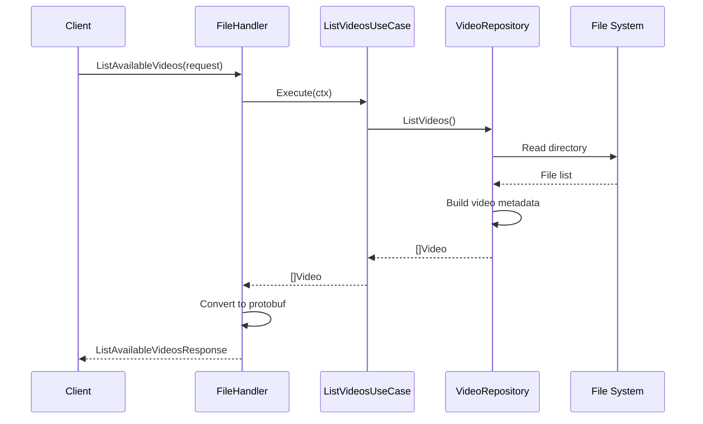
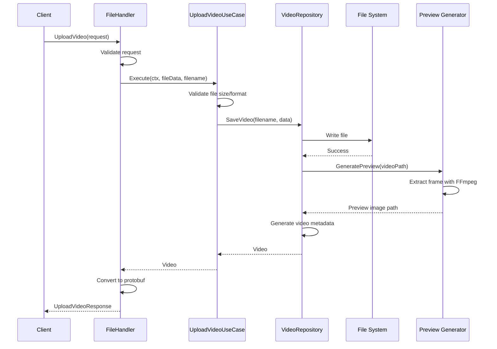

# CUDA Image Processor - Web Server

GPU-accelerated image processing web application using CUDA, Go, C++, and Protocol Buffers.

## Development Mode

For local development with hot reload:

### Quick Start

From project root:
```bash
./scripts/dev/start.sh --build  # First time or after code changes
./scripts/dev/start.sh           # Subsequent runs
```

This will:
1. Build the server and frontend
2. Start the C++ accelerator client, the Go API, and the Vite dev server (feature flags are read in-process from a local Goff YAML file)
3. Enable hot reload for the frontend (Vite dev server)

**Access:** https://localhost:3000 (Vite dev server) — the Go API is at https://localhost:8443

### Manual Build

Build the Go server from `src/go_api/`:
```bash
cd src/go_api
make build
```

Or from project root:
```bash
cd src/go_api && make build
```

Run the server:
```bash
cd src/go_api
make run
```

Or with config file (from project root):
```bash
./bin/server -config=config/config.yaml
```

### Development Mode

Run the server directly (`go run`):
```bash
cd src/go_api
make dev
```

## Production Mode

For production:

```bash
cd src/go_api
make build
./bin/server -config=../../config/config.production.yaml
```

The frontend is built with Vite and served by Nginx.

## Architecture

The web server implements Clean Architecture with clear separation of concerns across four main layers: Interfaces, Application, Domain, and Infrastructure.

### Component Overview

The web server follows Clean Architecture principles with clear separation between interfaces, application logic, domain models, and infrastructure. It integrates with the C++ CUDA accelerator library via gRPC.



### Directory Structure

```
src/go_api/
├── cmd/server/          # Main entry point (main.go)
├── pkg/
│   ├── application/     # Use cases (business logic)
│   │   ├── flags/       # Feature flag use cases
│   │   ├── media/       # Media use cases (image, video)
│   │   └── platform/    # Platform use cases (system)
│   ├── domain/          # Domain models
│   │   ├── device_status.go
│   │   ├── feature_flag.go
│   │   ├── image.go
│   │   ├── image_repository.go
│   │   ├── system_info.go
│   │   └── video_repository.go
│   ├── infrastructure/  # External integrations
│   │   ├── processor/   # C++/CUDA integration
│   │   │   ├── accelerator_gateway.go
│   │   │   ├── camera_repository.go
│   │   │   ├── control_server.go
│   │   │   ├── registry.go
│   │   │   ├── session.go
│   │   │   └── signaling_adapter.go
│   │   ├── featureflags/ # Goff integration (YAML-based)
│   │   ├── filesystem/  # File repositories
│   │   ├── mqtt/        # MQTT device monitoring
│   │   ├── video/       # Video repositories
│   │   ├── logger/      # Structured logging
│   │   ├── config/      # Config repository
│   │   ├── version/     # Version info
│   │   └── build/       # Build info
│   ├── interfaces/      # HTTP/Connect-RPC handlers
│   │   ├── connectrpc/  # Connect-RPC handlers
│   │   │   ├── server.go
│   │   │   ├── config_handler.go
│   │   │   ├── file_handler.go
│   │   │   ├── webrtc_handler.go
│   │   │   ├── webrtc_session_manager.go
│   │   │   ├── remote_management_handler.go
│   │   │   └── vanguard.go
│   │   ├── http/        # HTTP handlers
│   │   │   ├── health_handler.go
│   │   │   ├── logs_proxy.go
│   │   │   └── trace_proxy.go
│   │   └── adapters/   # Protocol adapters
│   ├── config/          # Configuration management
│   ├── container/       # Dependency injection
│   ├── app/             # Application setup
│   └── telemetry/       # OpenTelemetry integration
```

Frontend source: `../front-end/` (Vite in development, Nginx-served static assets in production).

## Key Components

### Interfaces Layer

**Connect-RPC Handlers** (`pkg/interfaces/connectrpc/`):
- `server.go`: Connect-RPC service registration (Config, File, WebRTCSignaling, RemoteManagement)
- `config_handler.go`: Configuration and system info handler
- `file_handler.go`: File upload and listing handler
- `webrtc_handler.go`: WebRTC signaling handler
- `webrtc_session_manager.go`: Manages WebRTC signaling sessions and peer connections
- `remote_management_handler.go`: Remote device management (Jetson Nano)
- `vanguard.go`: REST API transcoder using Vanguard for google.api.http annotations

**HTTP Handlers** (`pkg/interfaces/http/`):
- `health_handler.go`: Health check endpoints
- `logs_proxy.go`: Loki logs proxy
- `trace_proxy.go`: Jaeger trace proxy

Static `/data/` assets are served by the Vite dev server (`serveDataDirPlugin`) in development and by Nginx in production.

### Application Layer

**Use Cases** (`pkg/application/`):

**Flags** (`pkg/application/flags/`):
- `EvaluateFeatureFlagBoolUseCase`: Evaluates boolean feature flags from Goff YAML configuration
- `EvaluateFeatureFlagStringUseCase`: Evaluates string variant feature flags from Goff YAML configuration

**Media** (`pkg/application/media/`):
- `image/`: Image management use cases
  - `ListAvailableImagesUseCase`: Lists available static images
  - `UploadImageUseCase`: Handles image uploads
- `video/`: Video management use cases
  - `ListVideosUseCase`: Lists available videos
  - `UploadVideoUseCase`: Handles video uploads
  - `ListInputsUseCase`: Lists available input sources

**Platform** (`pkg/application/platform/`):
- `system/`: System-level use cases
  - `GetSystemInfoUseCase`: Retrieves system information and build details

All use cases follow the same pattern: they receive domain models, orchestrate business logic, and return domain models or errors.

### Domain Layer

**Domain Models** (`pkg/domain/`):
- `Image`: Core image domain model with data, dimensions, format
- `Video`: Video domain model and repository interface
- `FeatureFlag`: Feature flag domain model
- `SystemInfo`: System information and build details
- `DeviceStatus`: Device monitoring status

### Infrastructure Layer

**Processor Integration** (`pkg/infrastructure/processor/`):
- `AcceleratorGateway`: Application-layer routing facade that reaches accelerators via the registry
  - `IsAvailable`: Reports whether at least one accelerator is currently registered (used by health checks)
  - `SignalingStream`: Routes WebRTC signaling through the registered accelerator's control stream
- `ControlServer`: mTLS gRPC server hosting AcceleratorControlService
  - Accepts inbound connections from C++ accelerator clients
  - Handles Register messages and creates AcceleratorSession instances
  - Dispatches responses via pendingMap correlation
- `Registry`: Thread-safe map of device_id to AcceleratorSession
  - v1 enforces single-accelerator policy (map shape supports v2 multi-device)
  - Methods: Add, Remove, Get, First
- `AcceleratorSession`: Wraps a live bidi stream with device metadata
  - `Send`: Thread-safe message writing via mutex serialization
  - `Await`: Blocks on command_id channel for response correlation
  - `SubscribeSignaling`/`UnsubscribeSignaling`/`deliverSignaling`: WebRTC signaling fanout
  - Inner `pendingMap` maps command_id to response channels
- `signaling_adapter.go`: Adapts accelerator bidi stream to WebRTC signaling service interface
- `camera_repository.go`: `RegistryCameraSource` reads the camera list from the first registered accelerator session

**Feature Flags** (`pkg/infrastructure/featureflags/`):
- Goff client integration for feature flag management (YAML-based)
- Repository pattern for feature flag evaluation
- Local YAML file configuration (not Flipt server)

**File System** (`pkg/infrastructure/filesystem/`):
- Static image repository implementation
- File-based storage for uploaded images

**Video** (`pkg/infrastructure/video/`):
- Video repository implementation
- FFmpeg integration for video processing
- Preview generation for video files

### Dependency Injection

**Container** (`pkg/container/`):
- Centralized dependency injection
- Creates and wires all components
- Manages lifecycle of use cases, repositories, and connectors

**App** (`pkg/app/`):
- Application setup and HTTP server configuration
- Registers all handlers and middleware
- Configures routing (Connect-RPC, REST via Vanguard, WebRTC signaling)

## Features

- **CUDA Acceleration**: GPU-powered image processing via gRPC remote service
- **Connect-RPC**: Type-safe RPC with HTTP/JSON and gRPC support
- **Vanguard**: RESTful API transcoding using google.api.http annotations
- **Protocol Buffers**: Multiple proto services (config_service, file_service, remote_management_service, webrtc_signal) plus the `accelerator_control` Connect bidi stream
- **Hot Reload**: Frontend development with Vite
- **Clean Architecture**: Domain → Application → Infrastructure → Interfaces layers
- **WebRTC**: Real-time video/image streaming with WebRTC signaling
- **OpenTelemetry**: Distributed tracing integration

### Initialization Flow



### Processing Flows

#### Accelerator Control Flow (Reverse Topology)



### Endpoint Sequence Diagrams

#### ListFilters

`ListFilters` does not travel through a backend RPC: the browser sends it over the per-session "control" WebRTC data channel directly to the C++ accelerator. The Go API only participates in signaling setup.



#### EvaluateFeatureFlag



#### GetSystemInfo



#### ListAvailableImages



#### UploadImage



#### ListVideos



#### UploadVideo



## Protocol Buffers

The project uses multiple proto service definitions:

- `proto/config_service.proto` - Configuration and system info (with REST annotations)
- `proto/file_service.proto` - File upload and listing (with REST annotations)
- `proto/image_processor_service.proto` - ControlRequest/ControlResponse messages carried over the WebRTC control channel (no service definition)
- `proto/webrtc_signal.proto` - WebRTC signaling service (with REST annotations)
- `proto/remote_management_service.proto` - Remote device management (with REST annotations)
- `proto/common.proto` - Shared message types
- `proto/accelerator_control.proto` - AcceleratorControlService mTLS bidi stream (C++ clients dial in)

Only `config_service`, `file_service`, `remote_management_service`, and `webrtc_signal` define services with `google.api.http` annotations for RESTful routing via the Vanguard transcoder.

Generate code:
```bash
./scripts/build/protos.sh
# Or manually:
docker run --rm -v $(pwd):/workspace -u $(id -u):$(id -g) cuda-learning-bufgen:latest generate
```

## Frontend

The frontend uses:
- **React** - React dashboard UI
- **TypeScript** - Type-safe JavaScript
- **Vite** - Build tool and dev server
- **Vitest** - Unit testing
- **Playwright** - E2E testing

**Development:**
```bash
cd ../front-end
npm install
npm run dev  # Vite dev server (full stack: ../scripts/dev/start.sh)
```

**Production:**
In production, the frontend is built with Vite and served by Nginx.

```bash
cd ../front-end && npm run build
```

## See Also

- [Main README](../../README.md) - Project overview and setup
- [Testing Documentation](../../docs/testing-and-coverage.md) - Test execution guide
